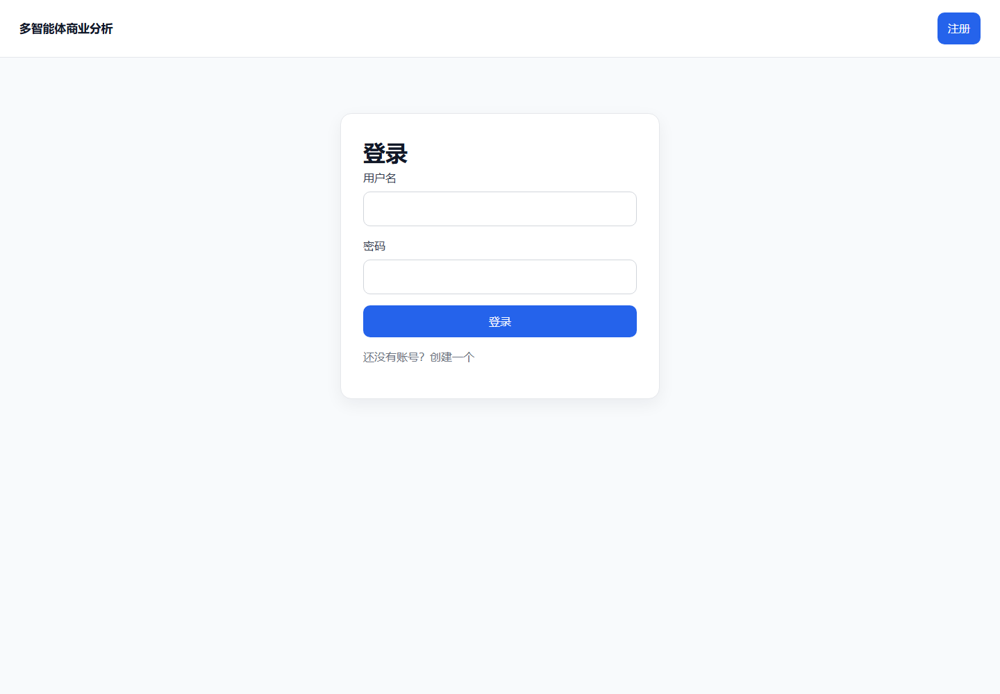
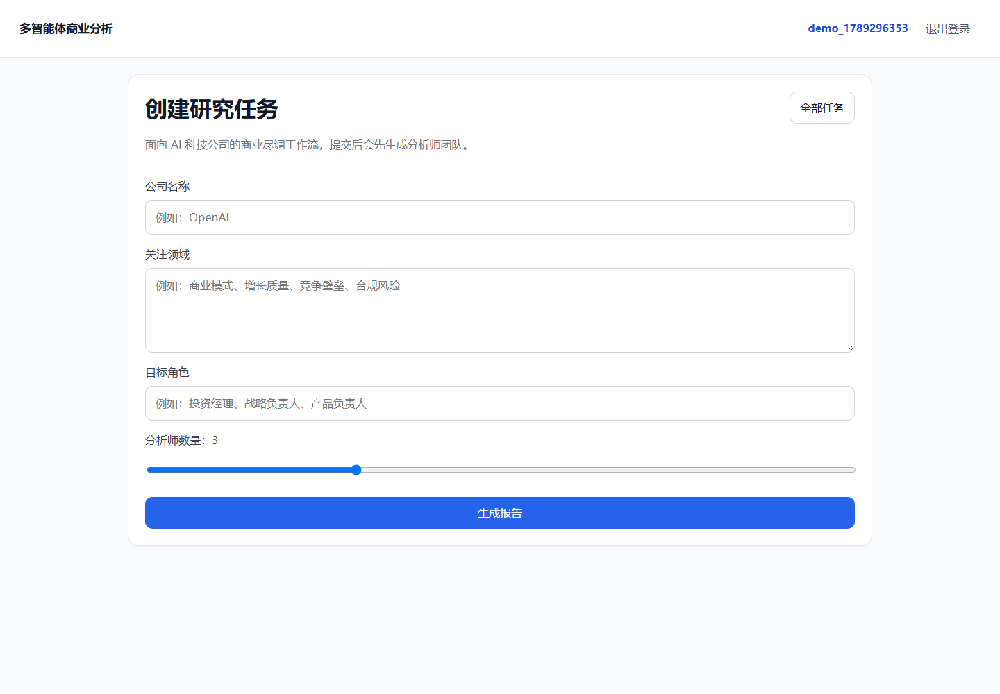
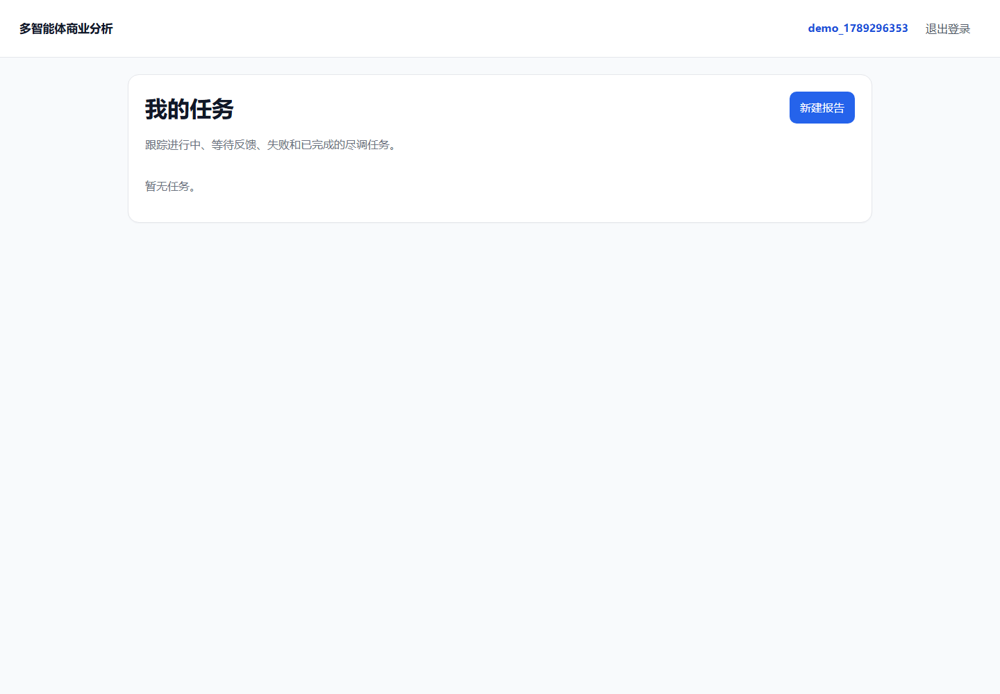

# Multi-Agent Business Analysis

一个基于 **LangGraph + FastAPI + React** 的多智能体商业尽调报告生成系统。

项目的重点不是“调用一次大模型写一份报告”，而是把商业尽调拆成一组可协作、可暂停、可恢复、可评估的 Agent 工作流：系统先生成分析师团队，等待用户审核；确认后，多位分析师并行完成多轮联网研究、证据清洗、事实压缩和章节撰写；最后由报告整合节点生成结构化报告，并导出 DOCX/PDF。

这个仓库同时展示了一套可复用的 Agent Harness：工具注册、搜索清洗、上下文压缩、证据追踪、任务运行时、指标观测和离线评估都被放在通用层，尽调领域只保留业务图、提示词和报告结构。

## Screenshots

本项目已在本地启动验证。以下截图来自 `FastAPI + Vite` 开发环境：

### 登录



### 创建研究任务



### 任务列表



## Highlights

- **多 Agent 尽调工作流**：市场、技术、财务、竞争、风险、报告整合等分析角色协作生成完整报告。
- **Human-in-the-loop**：分析师团队生成后通过 LangGraph interrupt 暂停，用户可审核、反馈并触发重新生成。
- **并行研究执行**：使用 LangGraph `Send` fan-out 为每位分析师启动独立访谈子图。
- **可复用 Harness 层**：工具、记忆、上下文、观测、评估与业务领域解耦。
- **联网搜索与证据清洗**：支持 Tavily、Serper、Bocha、SEC EDGAR、CNINFO、GitHub、Jina/Direct Reader 等资料源。
- **9 阶搜索管线**：URL 规范化、文本清洗、精确去重、近似去重、相关性评分、质量评分、事实结构化、Prompt Injection 防护、LLM-ready XML 格式化。
- **记忆与上下文压缩**：每轮研究后抽取结构化事实，维护 WorkingMemory、RunningSummary、SourceRegistry，避免长上下文膨胀。
- **证据可追踪**：由代码生成稳定 source id，例如 `S1`、`S2`，事实压缩和报告引用围绕 source id 组织。
- **Checkpoint 恢复**：优先使用 LangGraph checkpointer 保存图状态，失败或服务重启后可从检查点继续。
- **任务观测与评估**：记录任务事件、节点耗时、token 使用、成本估算，并提供压缩保真、来源可追踪、搜索质量等评估脚本。

## Demo Flow

```text
用户输入公司名称和关注点
  -> 系统加载行业 Skill Pack
  -> LLM 生成分析师团队
  -> 暂停，等待用户审核
  -> 用户确认或提交反馈
  -> 多位分析师并行研究
  -> 每位分析师多轮执行：提问 -> 搜索 -> 回答 -> 压缩 -> 更新记忆
  -> 分析师写出各自章节
  -> 主图整合 introduction / body / conclusion
  -> 审查与定稿
  -> 导出 DOCX / PDF
```

## Architecture

```text
React + Vite Frontend
  用户登录、任务创建、分析师反馈、任务状态、报告下载

FastAPI Server
  认证、任务 API、报告服务、运行时状态、文件下载

Domain: due_diligence
  LangGraph 主图、访谈子图、尽调提示词、报告结构、领域记忆配置

Harness Core
  工具注册、搜索管线、记忆压缩、上下文组装、可观测性、评估框架、LLM 加载

Skill Packs
  Markdown 驱动的行业知识和分析师能力卡，目前主要实现 AI 行业尽调
```

设计上有一条清晰边界：

- `backend/domains/due_diligence/` 负责“这件业务怎么跑”。
- `backend/harness/` 负责“Agent 系统如何可靠运行”。
- `backend/skills/` 负责“行业知识和角色能力如何扩展”。
- `backend/server/` 与 `frontend/` 负责产品交付层。

## Core Workflow

### Main Graph

主图位于 `backend/domains/due_diligence/graph.py`。

```text
START
  -> classify_company_type
  -> assemble_skills
  -> create_analyst
  -> human_feedback
      -> regenerate_analyst -> human_feedback
      -> plan_research
  -> start_interviews
      -> conduct_interview x N
  -> write_report
  -> write_introduction
  -> write_conclusion
  -> review_report
  -> finalize_report
  -> END
```

关键点：

- `human_feedback` 是 LangGraph interrupt 暂停点，不只是普通表单状态。
- `conduct_interview` 是子图，每位分析师有独立状态、技能卡、研究计划和记忆。
- 并行分支合并时，state 字段通过 reducer 控制合并策略，避免 fan-out 写回冲突。

### Interview Subgraph

访谈子图位于 `backend/domains/due_diligence/interview.py`。

```text
START
  -> ask_question
  -> search_web
  -> generate_answer
  -> compress
  -> update_memory
  -> compact_history
      -> ask_question
      -> save_interview
  -> write_section
  -> review_section
  -> END
```

这里把业务节点和基础设施节点分开：

- `ask_question`、`search_web`、`generate_answer`、`write_section` 属于尽调业务逻辑。
- `compress`、`update_memory`、`compact_history` 来自 Harness 记忆层，可复用于其他研究型 Agent。

## Memory Design

长程研究型 Agent 最大的问题是上下文越来越长、证据重复、事实冲突难以管理。本项目使用“原始状态保留 + 投影式上下文组装”的设计。

```text
Graph Checkpoint
  保存原始 messages、搜索结果、压缩事实、source registry

IncrementalCompressor
  每轮 Q&A 后抽取结构化事实

WorkingMemory
  维护当前事实账本、覆盖度、缺口、风险和冲突

RunningSummary
  将旧历史压缩成增量摘要

ContextAssembler
  按 token budget 为下一次 LLM 调用组装输入
```

核心原则：**checkpoint 是事实记录，ContextAssembler 只是本次 LLM 输入的投影**。系统不会为了省 token 而原地破坏原始历史。

## Search & Evidence Pipeline

工具层位于 `backend/harness/tools/`，统一把外部搜索结果转换为 `SearchDocument`，再经过清洗管线。

```text
LLM 生成搜索 query
  -> 根据 source_type / policy 选择搜索后端
  -> SearchTool.search 返回 SearchDocument[]
  -> CanonicalizeURLStage
  -> CleanTextStage
  -> ExactDeduplicateStage
  -> NearDuplicateStage
  -> RelevanceScoreStage
  -> QualityScoreStage
  -> StructureFactsStage
  -> OutputGuardStage
  -> FormatDocumentStage
  -> 输出可注入 LLM 的 <Document> XML
```

证据追踪方式：

- 搜索结果由代码分配稳定 source id。
- 压缩事实只能引用 registry 中存在的 source id。
- 同一个 URL 在后续轮次出现时复用已有 source id。
- 报告写作阶段通过 registry 回溯来源，减少模型编造引用的空间。

## Skill Pack System

技能包位于 `backend/skills/ai/`，以 Markdown 文件描述分析师能力和行业知识。

```text
competition-analyst.md
financial-analyst.md
market-analyst.md
tech-analyst.md
risk-analyst.md
report-integrator.md
domain-memory.md
```

加载方式：

1. `SkillRegistry` 扫描 `backend/skills/<industry>/`。
2. 解析 Markdown frontmatter 与正文。
3. `create_analyst` 将技能目录注入分析师生成提示词。
4. 每位分析师绑定一个 `skill_id`。
5. 访谈时把对应 `skill_card.body` 注入该分析师的系统提示词。

这使“行业知识”尽量以数据方式扩展，而不是每增加一个行业就改一批业务代码。

## Tech Stack

| Layer | Stack |
|---|---|
| Backend | Python 3.11+, FastAPI, Uvicorn |
| Orchestration | LangGraph, LangChain |
| LLM Providers | OpenAI-compatible, Google Gemini, Groq, DeepSeek/Kimi compatible endpoints |
| Search/Browse | Tavily, Serper, Bocha, SEC EDGAR, CNINFO, GitHub Search, Jina/Direct Reader |
| Persistence | SQLite, JSON/JSONL runtime files, LangGraph checkpoint |
| Report Export | python-docx, reportlab |
| Frontend | React, Vite, React Router, TypeScript |
| Test/Eval | pytest, fixture-driven eval, custom scorers |

## Repository Structure

```text
.
|-- backend/
|   |-- start_api.py
|   |-- server/
|   |   |-- api/
|   |   |   |-- main.py
|   |   |   |-- routes/report_routes.py
|   |   |   `-- services/report_service.py
|   |   |-- database/db_config.py
|   |   `-- config.py
|   |-- domains/
|   |   `-- due_diligence/
|   |       |-- graph.py
|   |       |-- interview.py
|   |       |-- schemas.py
|   |       |-- memory_config.py
|   |       `-- prompts/
|   |-- harness/
|   |   |-- tools/
|   |   |-- memory/
|   |   |-- observability/
|   |   |-- evaluation/
|   |   |-- models/
|   |   |-- llm_loader.py
|   |   `-- skill_registry.py
|   |-- skills/
|   |   `-- ai/
|   |-- tests/
|   |-- eval_results/
|   `-- scripts/
|-- frontend/
|   |-- src/
|   |   |-- pages/
|   |   |-- components/
|   |   |-- api.ts
|   |   `-- App.tsx
|   `-- package.json
|-- analyst-nuwa-skill/
|-- requirements.txt
|-- pyproject.toml
`-- .env.example
```

## API Overview

主要接口定义在 `backend/server/api/routes/report_routes.py`。

| Endpoint | Method | Description |
|---|---:|---|
| `/health` | GET | 健康检查 |
| `/api/auth/signup` | POST | 注册并写入 session cookie |
| `/api/auth/login` | POST | 登录 |
| `/api/auth/logout` | POST | 登出 |
| `/api/auth/me` | GET | 当前用户 |
| `/api/skill-packs` | GET | 可用行业技能包 |
| `/api/reports` | POST | 创建尽调任务并启动后台生成 |
| `/api/tasks` | GET | 当前用户任务列表 |
| `/api/tasks/{task_id}` | GET | 任务详情 |
| `/api/tasks/{task_id}/events` | GET | 任务事件 |
| `/api/tasks/{task_id}/metrics` | GET | token、耗时、成本等指标 |
| `/api/tasks/{task_id}/feedback` | POST | 提交分析师反馈并继续图执行 |
| `/api/tasks/{task_id}/retry` | POST | 从 checkpoint 重试失败任务 |
| `/api/tasks/{task_id}/files/{file_name}` | GET | 下载报告文件 |

## Quick Start

### 1. Install Backend Dependencies

```bash
python -m venv .venv

# Windows PowerShell
.venv\Scripts\Activate.ps1

pip install -r requirements.txt
```

### 2. Configure Environment

Copy `.env.example` to `.env` and fill in the required keys.

```env
LLM_PROVIDER=openai
LLM_MODEL_NAME=qwen-plus
LLM_TEMPERATURE=0
LLM_MAX_OUTPUT_TOKENS=8192

OPENAI_BASE_URL=
OPENAI_API_KEY=your_key

TAVILY_API_KEY=your_tavily_key

APP_ROOT=backend
FRONTEND_ORIGINS=http://localhost:5173,http://127.0.0.1:5173
SESSION_COOKIE_NAME=session_id
SESSION_COOKIE_SECURE=false
SESSION_COOKIE_SAMESITE=lax
```

Optional providers and search backends:

```env
GOOGLE_API_KEY=
GROQ_API_KEY=
SERPER_API_KEY=
BOCHA_API_KEY=
BRAVE_SEARCH_API_KEY=
JINA_API_KEY=
GITHUB_API_TOKEN=
```

### 3. Start Backend

```bash
python backend/start_api.py
```

Backend defaults to:

```text
http://localhost:8000
```

If port `8000` is already occupied, run the backend on another port and point the frontend to it:

```powershell
cd backend
python -m uvicorn server.api.main:app --host 127.0.0.1 --port 8010

cd ../frontend
$env:VITE_API_BASE_URL="http://127.0.0.1:8010/api"
npm.cmd run dev
```

### 4. Start Frontend

```bash
cd frontend
npm install
npm run dev
```

Frontend defaults to:

```text
http://localhost:5173
```

## Testing & Evaluation

Run all backend tests:

```bash
python -m pytest backend/tests -q
```

Run focused suites:

```bash
python -m pytest backend/tests/harness -q
python -m pytest backend/tests/domains -q
```

Evaluation-related files:

```text
backend/harness/evaluation/
backend/tests/fixtures/
backend/eval_results/
```

Existing evaluation dimensions include:

- compression fidelity: whether compressed facts preserve key information and avoid hallucination;
- pipeline quality: deduplication, filtering and quality scoring behavior;
- source traceability: whether facts and report claims map back to valid source ids;
- reliability analysis: repeated eval runs with mean, variance and coefficient of variation.

## Current Scope

This project is currently best understood as a local development and demonstration system for multi-agent business analysis.

Implemented:

- end-to-end FastAPI + React workflow;
- LangGraph main graph and interview subgraph;
- human feedback loop with checkpoint continuation;
- AI industry skill pack;
- search adapters and cleaning pipeline;
- memory compression and context assembly;
- local runtime persistence and generated report export;
- backend tests and evaluation scripts.

Known limitations:

- local JSON/SQLite persistence is suitable for demos and development, not multi-instance production deployment;
- authentication is lightweight cookie session + SQLite;
- report quality depends on model capability, prompt stability and search result quality;
- `ai` is the main content-rich skill pack; broader industry packs still need real validation;
- some runtime and package metadata still reflect historical refactors and can be further cleaned.

## Roadmap

| Area | Direction |
|---|---|
| Skill Packs | Add a second real industry pack to validate data-driven extensibility |
| Evaluation | Surface eval results in the frontend and CI |
| Runtime | Replace local task files with a production-grade queue and database |
| Auth | Integrate a stronger identity system for multi-user deployment |
| Report Quality | Add stricter citation checks and reviewer scoring |
| Deployment | Provide containerized setup and environment templates |

## Why This Project Matters

The interesting part of this repository is the system design around long-running Agent workflows:

- how to pause and resume an LLM workflow safely;
- how to run multiple analysts in parallel without losing state;
- how to keep evidence traceable across search, compression and report writing;
- how to control context growth without mutating canonical history;
- how to separate reusable Agent infrastructure from domain-specific business logic.

That combination makes the project a practical reference for building research-heavy Agent applications, not just a one-off report generator.
